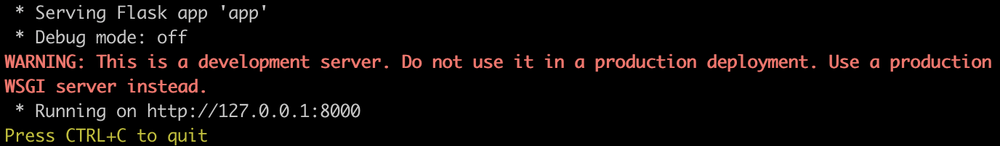

# :pizza: Wolt Summer 2024 Engineering Internship :pizza:

## Table of contents
1. [About The Project](#about-the-project)
   * [Technologies used](#technologies-used-computer)
3. [Installation](#installation)
4. [Usage](#usage)
5. [Response](#response-json)
6. [Spesifications](#specifications-for-the-task)
7. [License](#license) :construction: `added later`
8. [Contact](#contact)

## About the project
This is an API build for calculating delivery fees. It is a backend pre-assignment for Wolt's Summer 2024 Internship.
https://github.com/woltapp/engineering-internship-2024

### Technologies used :computer:
- **[Python3](https://docs.python.org/3/)**
- **[Flask](https://flask.palletsprojects.com/en/3.0.x/)**

## Installation
### 1. Clone the repository and navigate into it:
> ```bash
> git clone repository_name
> cd wolt_delivery_calculator
>   ```

### 2. Install requirements:
> [!IMPORTANT]
> ```bash
> pip install -r requirements.txt
> ```
> - This will ensure all the necessary tools are up-to-date
>
> :warning: in case of ```pip: command not found```,
> follow these instructions: https://pip.pypa.io/en/stable/installation/ :warning:

## Usage
### 1. Write in terminal: :pencil2:
> ```bash
> python3 main.py
> ```
> - This will start the application.
> - Example output:

> <p align="center" border="none">
>  
> </p>


### 2. Open your favourite browser:
> :arrow_right:  [http://localhost:8000/](http://localhost:8000/)

### 3. Send POST-request to the running program:
- :bulb:Example of a request payload (JSON):
> ```json
> {
> "cart_value": 790,
> "delivery_distance": 2235,
> "number_of_items": 4,
> "time": "2024-01-15T13:00:00Z"
> }
> ```
#### Field details

| Field             | Type  | Description                                                               | Example value                             |
|:---               |:---   |:---                                                                       |:---                                       |
|cart_value         |Integer|Value of the shopping cart __in cents__.                                   |__790__ (790 cents = 7.90€)                |
|delivery_distance  |Integer|The distance between the store and customer’s location __in meters__.      |__2235__ (2235 meters = 2.235 km)          |
|number_of_items    |Integer|The __number of items__ in the customer's shopping cart.                   |__4__ (customer has 4 items in the cart)   |
|time               |String |Order time in UTC in [ISO format](https://en.wikipedia.org/wiki/ISO_8601). |__2024-01-15T13:00:00Z__                   |
- Payload **must** contain atleast the fields mentioned above.
- Accepts only non-negative values as integers.
> [!TIP]
> :pencil2: Try it in terminal:
> ```bash
> curl -X POST -H "Content-type: application/json" -d "{\"cart_value\": 790, \"delivery_distance\": 2235, \"number_of_items\": 4, \"time\": \"2024-01-15T13:00:00Z\"}" "localhost:8000"
> ```

## Response (JSON)
The calculated delivery fee will be returned in JSON-format:
```json
{"delivery_fee": 710}
```

## Specifications for the task
Implement an HTTP API (single POST endpoint) which calculates the delivery fee based on the information in the request payload (JSON) and includes the calculated delivery fee in the response payload (JSON).

Rules for calculating a delivery fee
* If the cart value is less than 10€, a small order surcharge is added to the delivery price. The surcharge is the difference between the cart value and 10€. For example if the cart value is 8.90€, the surcharge will be 1.10€.
* A delivery fee for the first 1000 meters (=1km) is 2€. If the delivery distance is longer than that, 1€ is added for every additional 500 meters that the courier needs to travel before reaching the destination. Even if the distance would be shorter than 500 meters, the minimum fee is always 1€.
  * Example 1: If the delivery distance is 1499 meters, the delivery fee is: 2€ base fee + 1€ for the additional 500 m => 3€
  * Example 2: If the delivery distance is 1500 meters, the delivery fee is: 2€ base fee + 1€ for the additional 500 m => 3€
  * Example 3: If the delivery distance is 1501 meters, the delivery fee is: 2€ base fee + 1€ for the first 500 m + 1€ for the second 500 m => 4€
* If the number of items is five or more, an additional 50 cent surcharge is added for each item above and including the fifth item. An extra "bulk" fee applies for more than 12 items of 1,20€
  * Example 1: If the number of items is 4, no extra surcharge
  * Example 2: If the number of items is 5, 50 cents surcharge is added
  * Example 3: If the number of items is 10, 3€ surcharge (6 x 50 cents) is added
  * Example 4: If the number of items is 13, 5,70€ surcharge is added ((9 * 50 cents) + 1,20€)
  * Example 5: If the number of items is 14, 6,20€ surcharge is added ((10 * 50 cents) + 1,20€)
* The delivery fee can __never__ be more than 15€, including possible surcharges.
* The delivery is free (0€) when the cart value is equal or more than 200€.
* During the Friday rush, 3 - 7 PM, the delivery fee (the total fee including possible surcharges) will be multiplied by 1.2x. However, the fee still cannot be more than the max (15€). Considering timezone, for simplicity, **use UTC as a timezone in backend solutions** (so Friday rush is 3 - 7 PM UTC). **In frontend solutions, use the timezone of the browser** (so Friday rush is 3 - 7 PM in the timezone of the browser).

## Contact
Roope Vuorenlehto

[Github @jungleistx](https://github.com/jungleistx)

[LinkedIn](https://www.linkedin.com/in/roope-vuorenlehto/)

[Project Link](https://github.com/jungleistx/wolt_delivery_calculator)

:arrow_up: [Back to top](#pizza-wolt-summer-2024-engineering-internship-pizza)